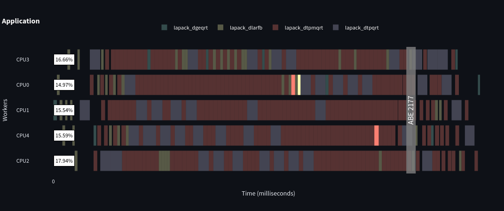
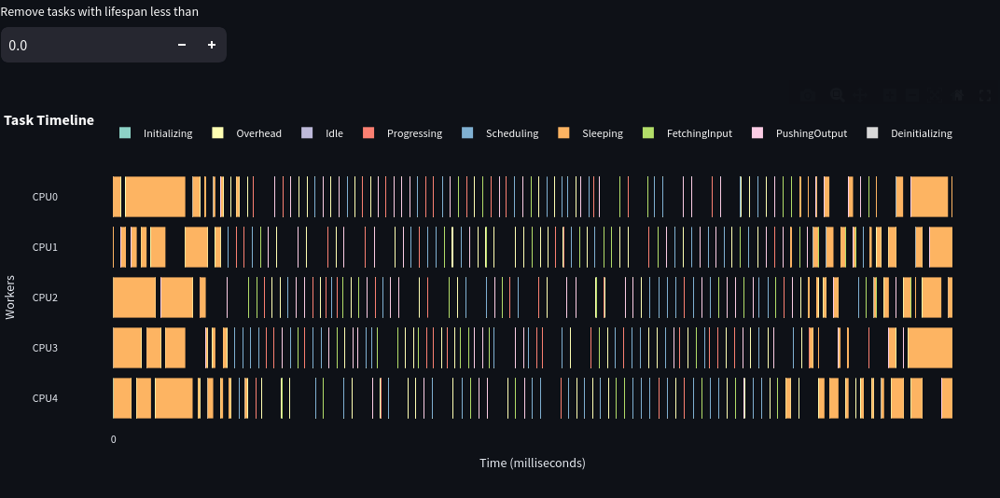
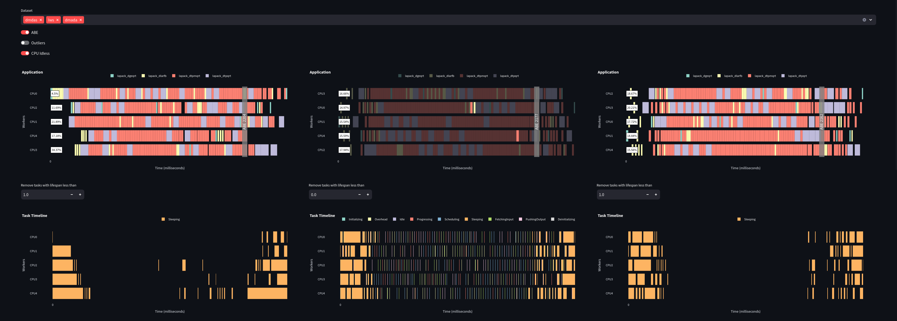
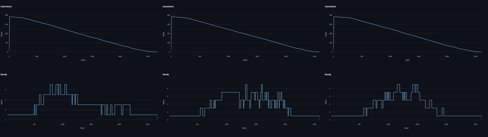

# Application Task Dependencies and StarPU Monitoring

## Summary

In today's fast-paced computing environment, efficient task management is crucial for optimizing performance and resource utilization. This application provides users with powerful visual tools to manage task dependencies and monitor StarPU actions effectively.

The application features an intuitive interface that highlights task dependencies, allowing users to easily identify which tasks are reliant on others. By clicking on a specific task, users can visualize all dependent tasks, facilitating better decision-making and workflow optimization.

The StarPU monitoring panel displays all actions performed by StarPU, with a default filter that shows only tasks exceeding 1 millisecond. This feature enables users to focus on significant tasks while offering the flexibility to adjust filters for a more tailored view.

Additionally, users can analyze multiple datasets side by side in the StarPU application panel. This panel includes analytical options such as Area Bound Estimation (ABE), which indicates the minimum execution time required, and Outliers, which highlights tasks that exceed expected durations. The CPU Idleness metric further enhances insights by showing the percentage of time the CPU core remains idle.

Finally, the submitted and ready tasks panel provides a clear overview of task statuses, distinguishing between tasks waiting for dependencies and those ready for execution. 

By leveraging these visual tools, users can streamline their task management processes, enhance performance monitoring, and ultimately improve the efficiency of their workflows. This application empowers users to take control of their task execution, making it an essential tool for anyone working with StarPU.

## Task Dependency Visualization

When a user clicks on a specific task, the system highlights all tasks that are dependent on it. This feature allows users to easily identify the relationships between tasks and understand the flow of execution, enhancing their ability to manage and optimize task performance.

## StarPU Task Monitoring

This panel displays all actions performed by StarPU. By default, only tasks that exceed a duration of 1 millisecond are shown, allowing users to focus on significant tasks. Users have the flexibility to adjust this filter to view tasks of varying durations, providing a customizable monitoring experience.

## Dataset Selection and Analysis

In this panel, users can select multiple datasets and view them side by side, column by column. Additionally, users can enable various analytical options to enhance their data analysis:

1. **ABE (Area Bound Estimation)**: This feature indicates the minimum time required to execute the code, excluding time lost due to StarPU overhead and memory transfers.
2. **Outliers**: This option highlights tasks that took longer than their counterparts, allowing users to quickly identify performance bottlenecks.
3. **CPU Idleness**: This metric displays the percentage of time that the CPU core was idle, providing insights into CPU utilization and efficiency.

## Task Status Overview

This panel provides a clear overview of the submitted and ready tasks:
- **Submitted Tasks**: These tasks are currently waiting for their dependencies to be resolved before they can be executed.
- **Ready Tasks**: These tasks are fully prepared and can be executed at any moment, allowing for efficient task management and execution.
